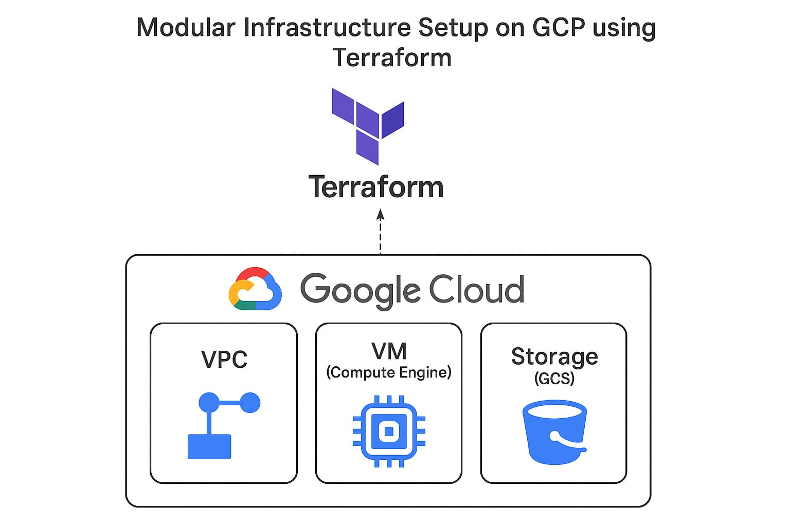

# Terraform Google Cloud Automation

Hi! 👋

This project helps me (and you!) automatically create cloud resources in Google Cloud — like virtual machines (VMs), VPCs, subnets, firewall rules, and storage — all using Terraform code.

Instead of opening the GCP console and clicking through a bunch of menus every time, I write the code once and can reuse it for any project. It saves a lot of time and avoids mistakes.

---

## Project Overview



---

## Why I made this project and why you might want to use it:

- ⏱️ **Saves Time:**  
No more manual setup for each resource. One command and everything is created.

- ♻️ **Reusable Code:**  
You can use the same Terraform scripts for different projects by just changing some variables.

- 🔧 **Fewer Mistakes:**  
Automating infrastructure setup means fewer human errors.

- 📦 **Scalable:**  
Easily add more VMs or create different environments like dev, test, or prod.

- 🧠 **Learning Opportunity:**  
It's a great way to learn Terraform and Google Cloud — both valuable skills right now.

---

Feel free to use, modify, and improve this project for your own cloud automation needs!
## Usage

Run these commands in your project directory to manage your infrastructure:

```bash
terraform init     # Initialize Terraform (run this first)
terraform fmt      # Format your Terraform files
terraform validate # Check your configuration for errors
terraform plan     # Preview the changes Terraform will make
terraform apply    # Apply the changes to create/update infrastructure
terraform destroy  # Destroy all managed infrastructure (be careful!)